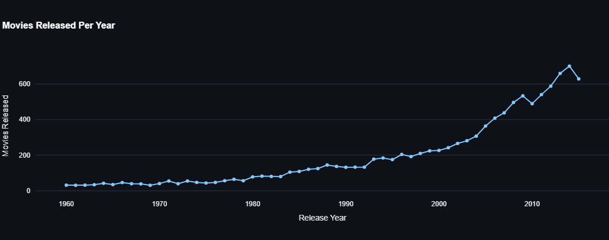
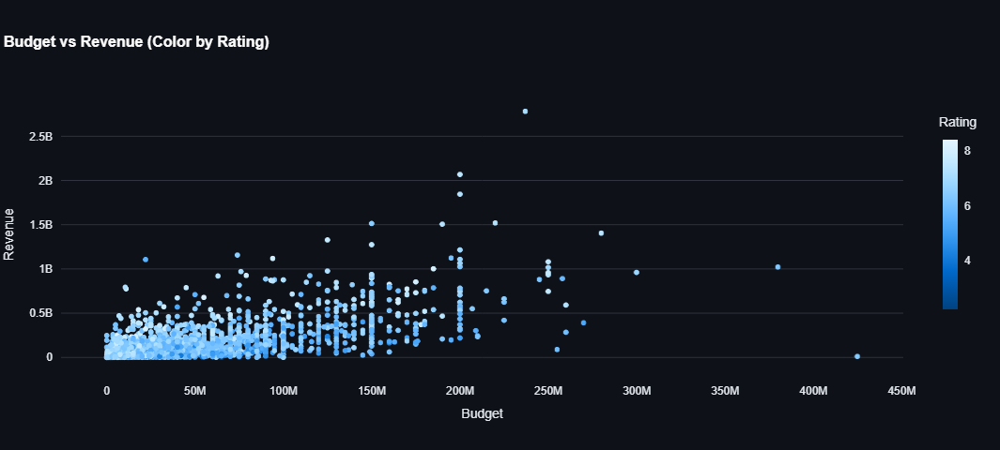

# 🎬 TMDb Movie Dataset Analysis  

  

## 📌 Project Overview  
This project explores **The Movie Database (TMDb) dataset**, containing details on **10,866 movies across 21 features**, including user ratings, revenue, genres, and more. The goal is to perform **Exploratory Data Analysis (EDA)** to uncover insights, trends, and patterns in the movie industry.  

---

## 🗂️ Dataset Overview  
📂 **Dataset:** TMDb Movie Dataset  
📊 **Total Movies:** 10,866  
📌 **Total Features:** 21  
⚠️ **Note:** Some columns contain missing values and were cleaned before analysis.  

---

## ❓ Key Questions Explored  
This analysis answers **15 key questions**, revealing interesting movie industry trends:  

1️⃣ **Which year had the highest number of movie releases?**  
2️⃣ **Which movie had the highest and lowest profit?**  
3️⃣ **Top 10 highest-grossing movies?**  
4️⃣ **Movies with the highest and lowest budgets?**  
5️⃣ **Which movies made the highest and lowest revenue?**  
6️⃣ **Which movies had the shortest and longest runtimes?**  
7️⃣ **Which movies received the highest and lowest ratings?**  
8️⃣ **Which year had the highest profit rate?**  
9️⃣ **Which movie runtimes were most liked by audiences based on popularity?**  
🔟 **What is the average movie runtime over the years?**  
1️⃣1️⃣ **How do revenue and popularity correlate with budget and runtime?**  
1️⃣2️⃣ **Which month had the highest number of movie releases?**  
1️⃣3️⃣ **Which month generated the highest average revenue?**  
1️⃣4️⃣ **Which genre had the highest number of movie releases?**  
1️⃣5️⃣ **Top 20 production companies with the highest number of releases?**  

---

## 📊 Data Processing & Cleaning  
- **Handled missing values** to ensure data consistency  
- **Dropped irrelevant columns** that didn’t contribute to the analysis  
- **Feature Engineering**: Created new insights such as **profit calculation**  
- **Data Transformation**: Converted timestamps, formatted categorical values  

---

## 📈 Visualizations & Insights  
The project utilizes **Matplotlib & Seaborn** for data visualization.  

<p align="center">
  
  
</p>  

### ✨ Key Insights:  
🎥 **2014 had the highest number of movie releases.**  
💰 **Revenue is directly connected to the budget.**  
📊 **Movies with higher budgets have shown a corresponding increase in the revenues.**  

---

## 🛠️ Technologies Used  
🔹 **Python** 🐍  
🔹 **Pandas, NumPy** for data handling  
🔹 **Matplotlib, Seaborn** for data visualization  
🔹 **Jupyter Notebook** for interactive analysis  

---

## 🚀 How to Run  
Clone the repository and install dependencies:  

```bash

git clone https://github.com/leviackerman007/Movie_Data_Explorer.git
cd Movie_Data_Explorer
pip install -r requirements.txt
jupyter notebook

```
Open `Movie_Analysis.ipynb` and execute the cells to explore the dataset.  

---

## 🔮 Future Improvements  
✅ Extend analysis with **sentiment analysis on reviews**  
✅ Integrate **machine learning for revenue prediction**  
✅ Improve **interactive visualizations with Plotly**  

---

## 📌 Conclusion  
This project provides valuable insights into **movie trends, profitability, and audience preferences**. The results can help **producers, studios, and analysts** understand key factors contributing to successful movies.  

⭐ If you found this useful, **consider giving this repo a star!**  

📬 **Contact:** [pandeytushart522@gmail.com](mailto:pandeytushart522@gmail.com) | [LinkedIn](https://linkedin.com/in/tushar-pandey-ab94a418a)  

