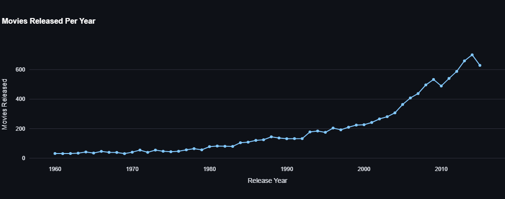
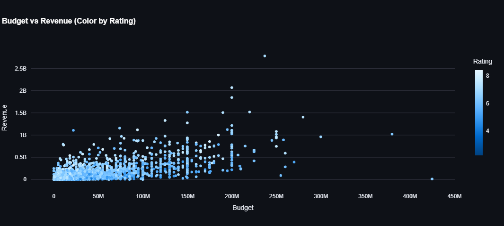

# TMDb Movie Intelligence Dashboard


An end-to-end analytics project that evolves notebook EDA into an interactive, deployment-ready Streamlit product.

## Live Links
- Live App: [TMDb Movie Intelligence Dashboard](https://moviedataexplorer-3bkxp7capsll26c72w4duu.streamlit.app/)
- GitHub Repository: [Movie_Data_Explorer](https://github.com/leviackerman007/Movie_Data_Explorer)

## Why This Is Resume-Ready
- Converts analysis work into a user-facing data product.
- Includes data cleaning, feature engineering, and business-focused storytelling.
- Uses interactive filters and downloadable outputs for practical decision support.

## Project Scope
This project analyzes the TMDb movies dataset (10K+ records) to uncover patterns in:
- release trends over time
- budget, revenue, and profitability behavior
- genre, director, and production-company contribution
- audience response through ratings and popularity

The original notebook is in [Movie_Analysis.ipynb](Movie_Analysis.ipynb), and the productionized app is in [app.py](app.py).

## Dashboard Highlights
- Sidebar filters by release-year range and genre
- KPI cards for movies, average rating, total revenue, and median profit
- Executive summary tab with business notes
- Revenue projection view (3/5/7 years)
- Interactive visuals:
1. releases by year and month
2. budget vs revenue scatter
3. top profitable movies
4. feature correlation matrix
5. top genres, directors, and production companies
- Explorer table with CSV export of filtered data

## Dashboard Preview
| Release Trend Analysis | Budget vs Profit Relationship |
|---|---|
|  |  |

These visuals come from the analysis workflow and are now extended with interactive exploration in the deployed Streamlit app.

## Notebook (EDA) and App Relationship
- [Movie_Analysis.ipynb](Movie_Analysis.ipynb) is the research notebook where the original EDA and hypothesis testing were performed.
- [app.py](app.py) is the productionized interactive dashboard built from those notebook insights.
- Keeping both is recommended for portfolio quality: it shows analytical depth and product execution.

To run the notebook locally:
```bash
jupyter notebook Movie_Analysis.ipynb
```

## Tech Stack
| Area | Tools |
|---|---|
| Language | Python |
| Data | Pandas |
| Visualization | Plotly |
| App Framework | Streamlit |

## Project Structure
```text
Movie_Data_Explorer/
|-- app.py
|-- Movie_Analysis.ipynb
|-- README.md
|-- requirements.txt
|-- .streamlit/
|   `-- config.toml
|-- Dataset/
|   `-- tmdb_movies_data.csv
`-- images/
```

## Run Locally
```bash
git clone https://github.com/leviackerman007/Movie_Data_Explorer.git
cd Movie_Data_Explorer
python -m venv .venv
source .venv/bin/activate  # Windows: .venv\Scripts\activate
pip install -r requirements.txt
streamlit run app.py
```

Theme note:
- The app now follows Streamlit's user-selectable theme behavior, so reviewers can use Light or Dark mode from app settings.

## Deploy To Streamlit Community Cloud
1. Push your latest code to GitHub.
2. Open Streamlit Community Cloud and create a new app.
3. Select your repository and branch.
4. Set Main file path to `app.py`.
5. Deploy.

Status: This project is already deployed at [TMDb Movie Intelligence Dashboard](https://moviedataexplorer-3bkxp7capsll26c72w4duu.streamlit.app/).

## Future Enhancements
- Add scenario planning bands (best/base/worst) for revenue projections.
- Add model-based forecasting with backtesting metrics.
- Add CI checks and lightweight data quality validation.

## Contact
- Email: [pandeytushart522@gmail.com](mailto:pandeytushart522@gmail.com)
- LinkedIn: [linkedin.com/in/tushar-pandey-ab94a418a](https://linkedin.com/in/tushar-pandey-ab94a418a)

